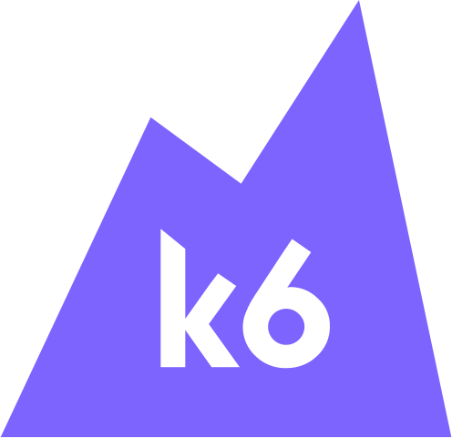

## Hey stranger :v:

I’m Mari and I like :coffee:, :pretzel: and :bacon:.
Apart from that, I do crossfit, trade forex and code industrial backends for a living.

### Languages & Frameworks

### Tools & Platforms

